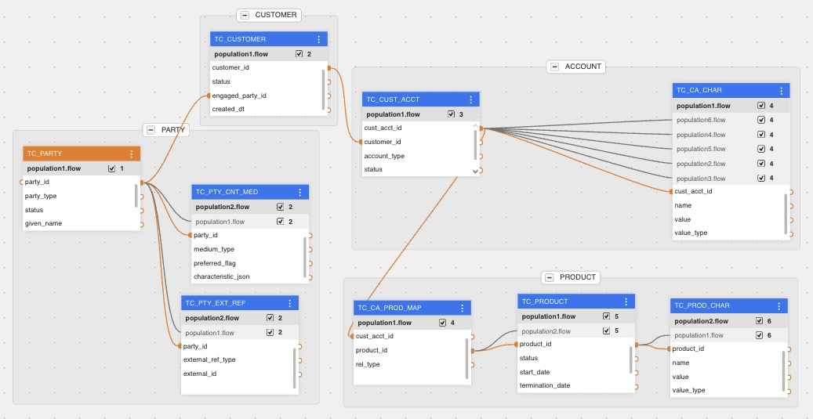
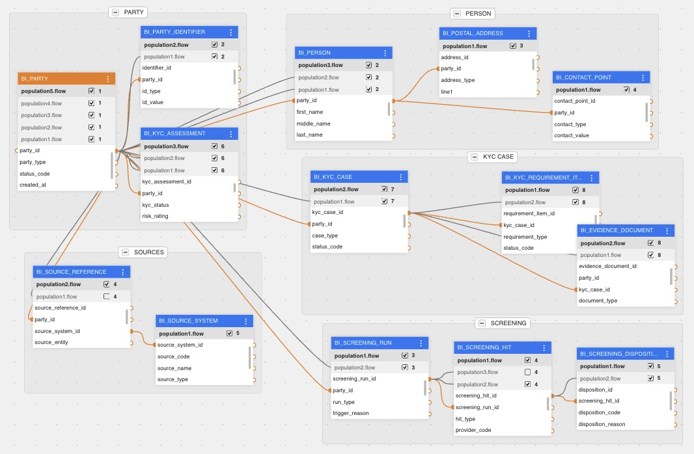

# Blackbox Mapping Lab

Blackbox is an AI-first mapping lab for complex source-to-target data
transformations. The project demonstrates that large, multi-source canonical
mappings can be expressed, generated, executed, debugged, and regression-tested
with a workflow where AI can inspect the spec, generated code, runtime outputs,
logs, reverse mappings, and golden comparisons.

The current focus is Java executable mappings for two canonical projects:

- `TMF`: telecom/customer/product canonical mapping.
- `BIAN`: banking/KYC/screening canonical mapping.

Each project creates one target SQLite database per canonical party instance,
loads that database from multiple source SQLite systems through generated Java
mapping files, and then runs a reverse consistency check that rebuilds source
databases from the generated targets.

## Visual Mapping Examples

### TMF

The TMF project demonstrates telecom-style canonical mapping from multiple
source systems (`SIEBEL_SYSTEM`, `BSCS_SYSTEM`, and `NCC_SYSTEM`) into party,
customer, billing, contact, product, and characteristic targets. It shows
end-to-end traceability from source/canonical metadata and mapping intent into
generated executable flows.

Key mapping patterns:
- multi-source same-entity support with coordinated target upserts;
- column-style mappings plus EAV/multi-row expansions for characteristic
  tables such as `TC_CA_CHAR` and `TC_PROD_CHAR`;
- party/customer-scoped runtime databases with reverse mapped-column checks.



### BIAN

The BIAN project demonstrates banking/KYC mapping from CRM, Temenos Core,
Oracle AML, MDM, and Dow Jones-style sources into party, KYC, screening, source
reference, and source-system targets. It is organized around party-scoped
orchestration and source xref bridging.

Key mapping patterns:
- XREF-first source lookup so canonical `party_id` drives source-specific reads;
- cross-source screening modeling, including derived screening-hit expansion;
- source lineage as first-class canonical data through `BI_SOURCE_REFERENCE`
  and `BI_SOURCE_SYSTEM`.



## Why This Project Exists

Complex enterprise mappings are difficult to maintain because the intent is
usually scattered across spreadsheets, generated artifacts, runtime code, logs,
and manually inspected test data. This project keeps those artifacts close
together and makes them inspectable by AI:

- source and target schemas are explicit;
- mapping specs generate intermediate representation and executable artifacts;
- Java mappings are self-contained and readable;
- runtime logs show each mapping flow;
- reverse checks prove mapped-column equivalence;
- golden JSON comparisons show remaining business/spec deltas.

The goal is not just code generation. The goal is reliable, explainable mapping
development where AI can help trace a value from source row to target row,
explain mismatches, propose spec clarifications, and safely refactor executable
mapping code.

## Current Status

Latest full Java validation run: May 21, 2026.

| Project | Forward Runtime | Reverse Consistency | Golden Comparison |
| --- | --- | --- | --- |
| TMF | Passed, `100` target DBs | Passed, `0` mismatches over `5085` mapped rows | Fails with `293` known golden/spec deltas |
| BIAN | Passed, `200` target DBs | Passed, `0` mismatches over `5211` mapped rows | Fails with `33` known golden/spec deltas |

Golden failures are currently treated as spec/golden alignment work, not runtime
or reverse-consistency failures. Project-specific README files summarize the
latest remaining deltas.

## Repository Layout

```text
generator/                     Shared spec/IR generation code
runtime/java/                  Common Java runtime core
projects/
  tmf/                         TMF project assets, runtime, reports, outputs
  bian/                        BIAN project assets, runtime, reports, outputs
generate.sh                    Generate JSON IR from project spec
materialize.sh                 Materialize executable/generated artifacts
validate.sh                    Validate project spec and schema contracts
requirements.txt               Python dependencies for generator/validation
```

## Most Important Files

Project summaries:

```text
projects/tmf/README.md
projects/bian/README.md
```

Project configuration:

```text
projects/tmf/project.yaml
projects/bian/project.yaml
projects/tmf/runtime/java/config/tmf-runtime.properties
projects/bian/runtime/java/config/bian-runtime.properties
```

Specs and metadata:

```text
projects/tmf/spec/
projects/bian/spec/
projects/tmf/metadata/
projects/bian/metadata/
```

Generated Java mappings:

```text
projects/tmf/tmp/implementations/java/src/main/java/com/blackbox/tmf/generated/
projects/bian/tmp/implementations/java/src/main/java/com/blackbox/bian/generated/
```

Runtime applications and reverse checkers:

```text
projects/tmf/runtime/java/src/main/java/com/blackbox/tmf/
projects/bian/runtime/java/src/main/java/com/blackbox/bian/
```

Runtime outputs:

```text
projects/tmf/tmp/java-runtime/
projects/bian/tmp/java-runtime/
```

Golden targets and validators:

```text
projects/tmf/tests/golden/
projects/bian/tests/golden/
projects/tmf/runtime/java/scripts/validate-golden-targets.sh
projects/bian/runtime/java/scripts/validate-golden-targets.sh
```

## Java Mapping Style

Generated Java mapping files are intentionally readable. They use:

- visible SQL in the mapping file;
- typed `SourceRow` records;
- self-contained transformation code;
- consistent forward/source/target/reverse sections;
- comments that follow execution order;
- no hidden generic forward executor.

The BIAN mappings use a K2View-style flow layout:

```text
Step 1: Identify the current target instance and source-to-target flow.
Step 2: Prepare audit data needed for reverse mapping.
Step 3: Read party-scoped source records.
Step 4: Audit mapped source columns.
Step 5: Map source rows into target rows.
Step 6: Write target rows to the entity-level database.
Step 7: Log source and target row counts.
```

TMF mappings follow the same section style while staying concise and typed.

## Common Commands

Validate/generate/materialize from spec:

```bash
./validate.sh -p tmf
./generate.sh -p tmf
./materialize.sh -p tmf

./validate.sh -p bian
./generate.sh -p bian
./materialize.sh -p bian
```

Run TMF Java:

```bash
mvn -q test -f projects/tmf/runtime/java/pom.xml
projects/tmf/runtime/java/scripts/smoke-party.sh
PYTHONDONTWRITEBYTECODE=1 projects/tmf/runtime/java/scripts/validate-golden-targets.sh
```

Run BIAN Java:

```bash
mvn -q test -f projects/bian/runtime/java/pom.xml
projects/bian/runtime/java/scripts/smoke-bian.sh
PYTHONDONTWRITEBYTECODE=1 projects/bian/runtime/java/scripts/validate-golden-targets.sh
```

Clean outputs:

```bash
projects/tmf/runtime/java/scripts/clean-party.sh
projects/bian/runtime/java/scripts/clean-bian.sh
```

## Debugging Workflow

The intended workflow is:

1. Start from the project README to understand current status.
2. Inspect the generated mapping file for the table/source pair.
3. Follow the visible source SQL to the source SQLite database.
4. Follow the transformation code into the target table write.
5. Check runtime logs for source and target row counts.
6. Use reverse reports to confirm mapped-column consistency.
7. Use golden reports to identify business/spec deltas.
8. Update mapping code, spec, or golden expectations depending on the root
   cause.

This is where the AI-first approach matters: each artifact is text or SQLite,
small enough to inspect directly, and organized so an assistant can explain the
lineage and propose targeted fixes.

## Output Locations

TMF:

```text
projects/tmf/tmp/java-runtime/data
projects/tmf/tmp/java-runtime/logs
projects/tmf/tmp/java-runtime/reverse-sources
projects/tmf/tmp/java-runtime/reverse-compare.json
projects/tmf/tmp/java-runtime/golden-target-compare.json
```

BIAN:

```text
projects/bian/tmp/java-runtime/data
projects/bian/tmp/java-runtime/logs
projects/bian/tmp/java-runtime/reverse-sources
projects/bian/tmp/java-runtime/reverse-compare.json
projects/bian/tmp/java-runtime/golden-target-compare.json
```

## Prerequisites

- Java 17+
- Maven
- Python 3.10+
- SQLite CLI for manual inspection

Install Python dependencies:

```bash
python -m pip install -r requirements.txt
```
